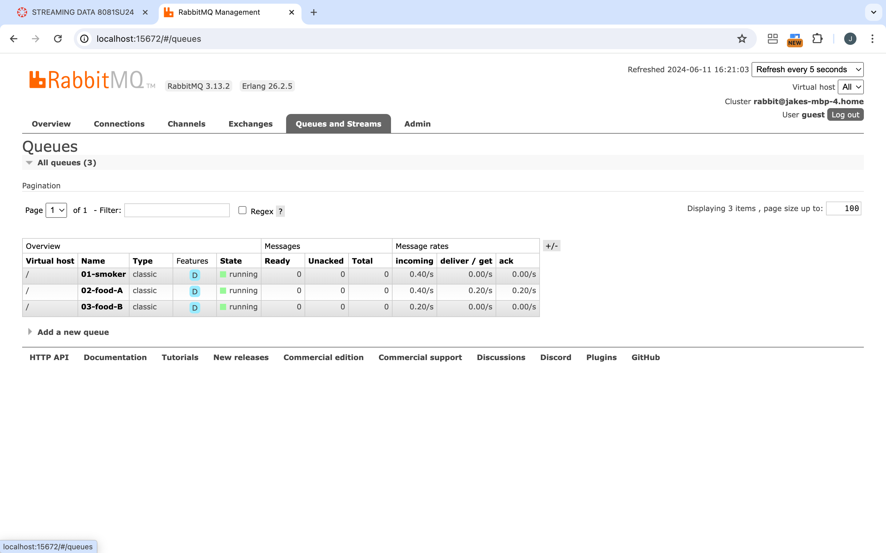
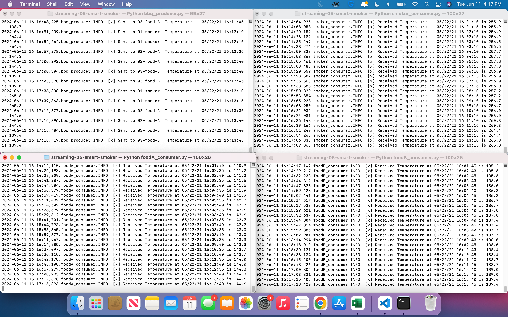
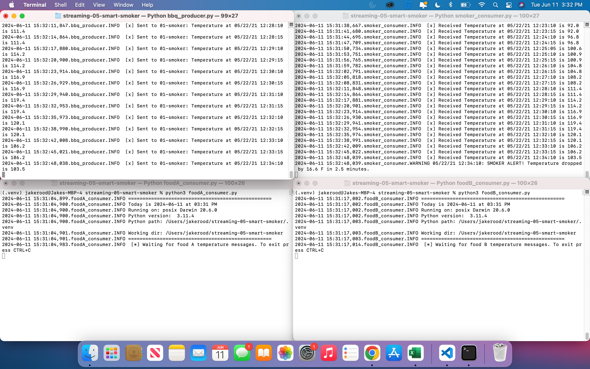
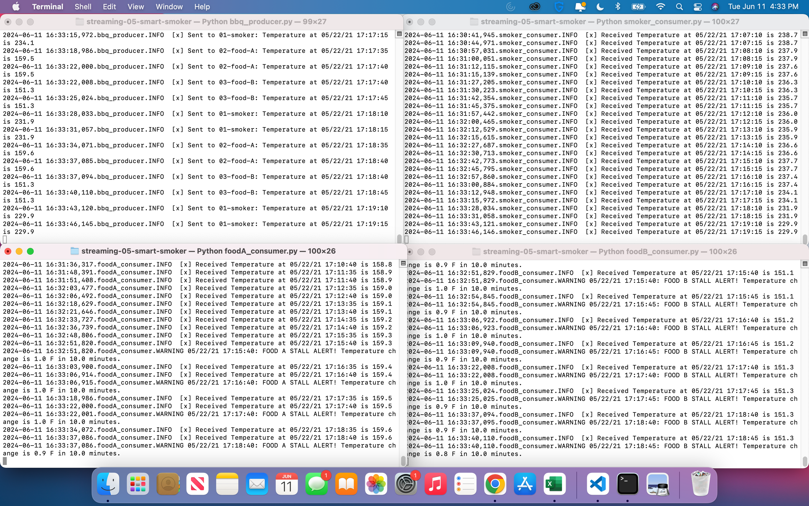
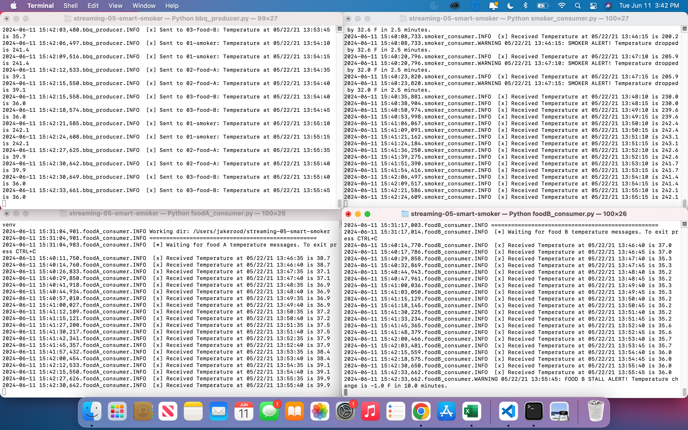

# streaming-05-smart-smoker

> Name: Jake Rood \
Date: June 11, 2024

Streaming data may come from web analytics, social media, smart devices, and more. In the next two modules, we'll look at implementing analytics for a "smart smoker" (as in slow cooked food). 

First, we'll understand the process, design our system, and implement the producer. Then, we'll add the consumers, implementing analytics based on a rolling window of time, and raise an alert when interesting events are detected.

## Prerequisites

1. Git
1. Python 3.7+ (3.11+ preferred)
1. VS Code Editor
1. RabbitMQ Server installed and running locally

## Before You Begin

1. Fork this starter repo into your GitHub.
1. Clone your repo down to your machine.

## Create a Python Virtual Environment

We will create a local Python virtual environment to isolate our project's third-party dependencies from other projects.

1. Open a terminal window in VS Code.
1. Use the built-in Python utility venv to create a new virtual environment named `.venv` in the current directory.

```shell
python3 -m venv .venv
```

Verify you get a new .venv directory in your project. 
We use .venv as the name to keep it away from our project files. 

## Activate the Virtual Environment

In the same VS Code terminal window, activate the virtual environment. On MacOS:

```shell
source .venv/bin/activate
```

Verify you see the virtual environment name (.venv) in your terminal prompt.

## Install Dependencies into the Virtual Environment

To work with RabbitMQ, we need to install the pika library.
A library is a collection of code that we can use in our own code.

We keep the list of third-party libraries needed in a file named requirements.txt.
Use the pip utility to install the libraries listed in requirements.txt into our active virtual environment. 

Make sure you can see the .venv name in your terminal prompt before running this command.

```shell
python3 -m pip install -r requirements.txt
```

## BBQ Producer

We want to stream information from a smart smoker. Information is stored in the "smoker-temps.csv" file. Read one value every half minute (sleep_secs = 30).

"smoker-temps.csv" has 4 columns:

[0] Time = Date-time stamp for the sensor reading\
[1] Channel1 = Smoker Temp --> send to message queue "01-smoker"\
[2] Channel2 = Food A Temp --> send to message queue "02-food-A"\
[3] Channel3 = Food B Temp --> send to message queue "03-food-B"

The file "bbq_producer.py" is the producer for this process. The script reads the values from the "smoker-temps.csv" file and sends the messages to appropriate queue.

To run the producer, open a terminal and run the following command:

```shell
python3 bbq_producer.py
```

The program will begin reading values from the CSV file and sending messages to the appropriate queue. Hit `CTRL+C` to manually interrupt the process.

## Consumers

We will use three different consumers, one for each queue.

### Smoker Consumer

The file "smoker_consumer.py" is the consumer that will receive the smoker temperatures from the producer. It receives messages from the queue "01-smoker"

To run the smoker consumer, open a second terminal and run the following command:

```shell
python3 smoker_consumer.py
```

The program will begin waiting for messages from the queue "01-smoker." Hit `CTRL+C` to manually interrupt the process.

### Food A Consumer

The file "foodA_consumer.py" is the consumer that will receive the Food A temperatures from the producer. It receives messages from the queue "02-food-A"

To run the food A consumer, open a third terminal and run the following command:

```shell
python3 foodA_consumer.py
```

The program will begin waiting for messages from the queue "02-food-A." Hit `CTRL+C` to manually interrupt the process.

### Food B Consumer

The file "foodB_consumer.py" is the consumer that will receive the Food B temperatures from the producer. It receives messages from the queue "03-food-B"

To run the food B consumer, open a fourth terminal and run the following command:

```shell
python3 foodB_consumer.py
```

The program will begin waiting for messages from the queue "03-food-B." Hit `CTRL+C` to manually interrupt the process.

## RabbitMQ Admin

RabbitMQ comes with an admin panel. When you run the BBQ producer, reply y to open it.

Below is a screenshot of the RabbitMQ admin panel showing the three queues in our process running.



## Screenshots

Below are screenshots of the four concurrent processes running and signifant events that will occur throughout the processes.

### Screenshot of BBQ Producer and All Three Consumers Running

Below is an example of the BBQ Producer, Smoker Consumer, Food A Consumer and Food B Consumer all running in their own respective terminals. The BBQ Producer is sending messages to one of three queues while the three consumers receive messages from their respective queue.



### Screenshot of Smoker Alert

Below is an example of the Smoker Consumer sending a Smoker Alert (see top righ terminal). A Smoker Alert is triggered if the smoker temperature decreases by more than 15 degrees F in 2.5 minutes.



### Screenshot of Food A Stall Alert

Below is an example of the Food A Consumer sending a Food Stall Alert (see bottom left terminal). A Food Stall Alert is triggered if the temperature of food A changes less than 1 degree F in 10 minutes.



### Screenshot of Food B Stall Alert

Below is an example of the Food B Consumer sending a Food Stall Alert (see bottom right terminal). A Food Stall Alert is triggered if the temperature of food B changes less than 1 degree F in 10 minutes.



## Sync Changes to GitHub
Now it's time to get the local work you did on your machine back up to your cloud repo in GitHub:

1. On the VS Code side panel, click the source control icon (look for a blue bubble with a number in it).
1. Important! Above the Commit button, it will say "Message".
1. You MUST include a commit message.
1. Click the down arrow on the blue "Commit" button to "Commit and Push" to your GitHub repo.

Verify: Open a browser to your GitHub repo and verify the changes have appeared.

Note: You can either sync all your changes at once at the end of the project OR you can sync your changes after completing each task individually.